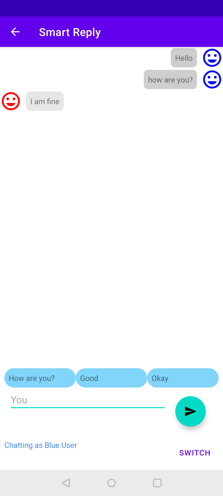
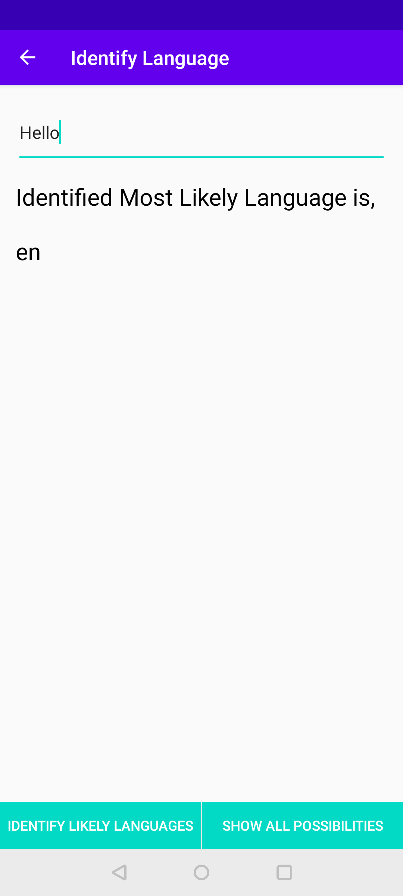
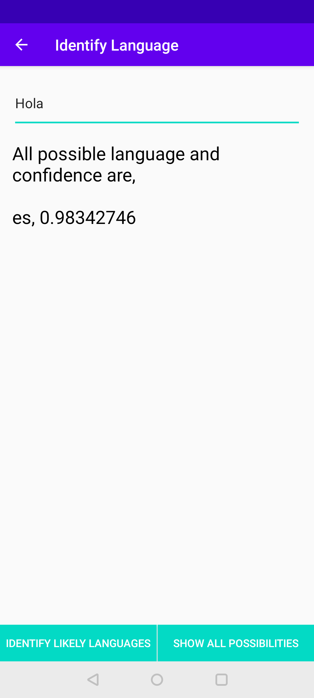
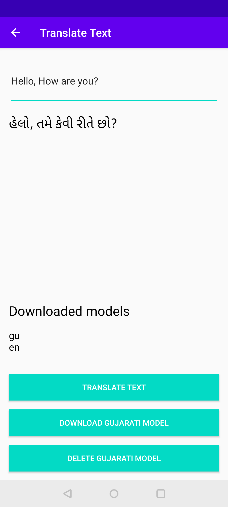

# NLP in Firebase ML-Kit


[](https://twitter.com/krunal3kapadiya)

Get the [NLP-MLKit.apk](misc/NLP-MLKit.apk)

## How to use this project?

1. Clone this repository
2. Create project in [Firebase Console](https://console.firebase.google.com/)
3. Download `google-services.json` file into `app` folder
4. Run the project.

> Read Article [here](https://krunal3kapadiya.app/post/nlp-in-ml-kit/)

## Screenshots

### 1. Smart Reply



### 2. Identify Languages

  

### 3. Translate Text



Want to read article on Medium, here is the [link](https://medium.com/@krunal3kapadiya/facts-you-should-know-before-starting-ml-kit-8f31dabeb0f)

#### [BUY ME A COFFEE ☕](https://www.paypal.me/krunal3kapadiya)

```
Copyright 2020 Krunal Kapadiya

Licensed under the Apache License, Version 2.0 (the "License");
you may not use this file except in compliance with the License.
You may obtain a copy of the License at

   http://www.apache.org/licenses/LICENSE-2.0

Unless required by applicable law or agreed to in writing, software
distributed under the License is distributed on an "AS IS" BASIS,
WITHOUT WARRANTIES OR CONDITIONS OF ANY KIND, either express or implied.
See the License for the specific language governing permissions and
limitations under the License.
```
